# Referenz: SENTRON Power Device Engineer (PDE) V9.1.0

**Zweck dieser Datei:** Verdichtete Faktensammlung aus der Online-Hilfe des PDE als Arbeitsgrundlage
für die Kapitel 400 (Gerätekonfiguration) und 500 (Einführung PDE, Auswahl der Daten, Mapping).
Kein Kapiteltext, keine Formulierungen — nur belegbare Fakten, Tabellen und Bildverweise.

**Quelle:** Exportierte HTML-Online-Hilfe (SCHEMA ST4) unter `../../NonCHM/`, Sprachstand `en-US`,
Dateistand 13.11.2025. Bibliographie-Key: `@src:pdemanual`.

**Belegstellen:** Jede Aussage unten ist mit der Topic-ID der Quelldatei versehen, z. B. `[16027603467]`
= `NonCHM/en-US/16027603467.html`. Damit ist jeder Satz im Kapitel rückverfolgbar.

---

## 1. Einordnung des Werkzeugs

- PDE ist eine **Standalone-Anwendung** zur Spezifikation, Konfiguration und Integration
  Modbus-fähiger Geräte in SENTRON-Applikationen. `[15977535755]`
- Ergebnis ist eine **JSON-Datei**, die die Gerätekommunikation gegenüber übergeordneten
  Applikationen beschreibt. `[15977535755]`
- Zielapplikationen: **SENTRON Powermanager V9.0** und **SENTRON Powercenter 3000 V1.11.0**.
  PDE V9.1.0 ist genau zu diesen Versionen kompatibel. `[15977535755]`
- Werkzeugkette: Gerätemanual/Modbus-Registerliste → PDE → JSON → Import in SENTRON-Applikation →
  Geräteinstanz anlegen → Monitoring. `[28037698955]`
- Voraussetzung für die Arbeit mit PDE: Gerätemanual und Modbus-Registerdetails liegen vor. `[16027603467]`

> **Relevanz für die Arbeit:** Desigo CC wird in der PDE-Doku *nicht* erwähnt. Die Doku nennt als
> Ziel ausschließlich Powermanager und Powercenter 3000. Die Brücke Powercenter → Desigo CC ist
> Eigenleistung der Arbeit und nicht durch diese Quelle belegbar.

### Toolbar `[33945821067]`

| Funktion | Bedeutung |
|---|---|
| Neu | JSON-Datei für einen neuen Gerätetyp erzeugen |
| Öffnen | JSON-Datei eines bestehenden Gerätetyps laden |
| Speichern | Konfiguration als JSON speichern |
| Online/Offline | Umschalten zwischen Online- und Offline-Modus |
| Hilfe | Online-Hilfe öffnen |
| Info | Versionsinformation (`About` → V9.1.0) `[23986237451]` |

---

## 2. Workflow: fünf Schritte, drei Wizard-Seiten

Der Wizard hat drei Seiten (`Device Features` → `Device Properties` → `Device Configuration`),
der dokumentierte Workflow gliedert sich in fünf Schritte. `[16027603467]`

| # | Schritt | Inhalt |
|---|---|---|
| 1 | Create New Device Type | Gerätetypname festlegen |
| 2 | Configure Features | Geräteeigenschaften/Kommunikationsmerkmale |
| 3 | Configure Properties | Datenpunkte mit Adressen, Datentypen, Transformationen |
| 4 | Configure Device | Messpunkte für Default-/Favorites-/Trend-Darstellung |
| 5 | Generate JSON File | Validieren und speichern |

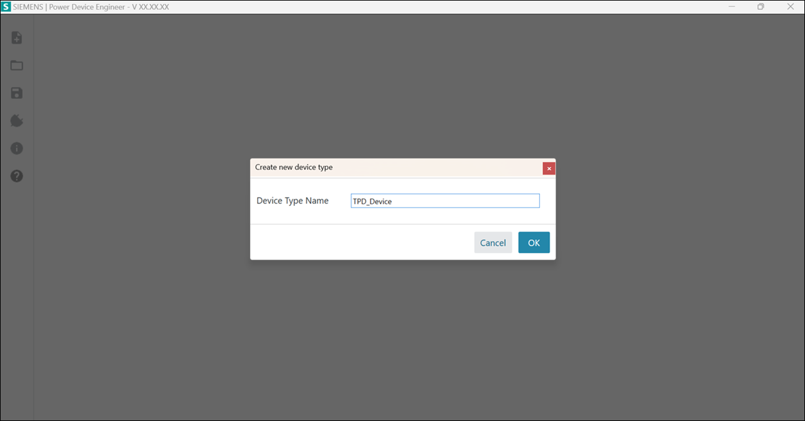
*Schritt 1 — `Create new device type`. Sonderzeichen und Leerzeichen im Namen sind nicht erlaubt,
zulässig ist nur der Unterstrich. `[16027603467]`*

---

## 3. Schritt 2 — Device Features `[33770546571]`

Die Seite besteht aus zwei Abschnitten: `Device Information` und `Features`.

**Device Information:** `Device Type Name` (Pflichtfeld), `Firmware Version`, `Model`, `Make`
(jeweils optional, nachträglich über das Edit-Icon änderbar `[33945816459]`).

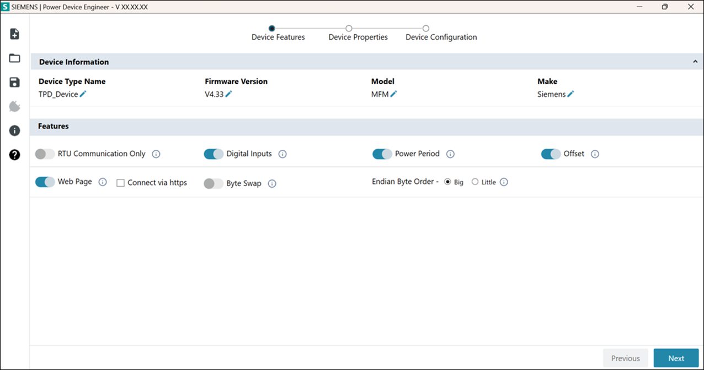
*Wizard-Seite 1. Sichtbar: Fortschrittsanzeige der drei Wizard-Schritte, Device Information mit
Edit-Icons, sieben Feature-Schalter. Im Screenshot aktiv: Digital Inputs, Power Period, Offset,
Web Page; Endian Byte Order auf `Big`.*

### Die sieben Features

| Feature | Bedeutung |
|---|---|
| **RTU Communication Only** | Für Geräte ohne Modbus-TCP-Fähigkeit (z. B. RS485, RS232) |
| **Digital Inputs** | Status und Kommandos des Geräts anzeigen und bedienen |
| **Power Period** | Mittelwert der Leistung über eine Periode; in SENTRON-Applikationen standardmäßig 15 min |
| **Offset** | Wert, der zur Basisadresse addiert wird, um die tatsächliche Adresse zu erhalten (Inkrement um 1) |
| **Web Page** | Für Geräte mit Webserver; Verbindung über `http` oder `https` (Checkbox `Connect via https`) |
| **Byte Swap** | Ändert die Byte-Reihenfolge binärer Daten |
| **Endian Byte Order** | Auswahl `Big` oder `Little` |

### Endianness — dokumentiertes Beispiel `[33770546571]`

Der 32-Bit-Float-Wert **12,34** entspricht hexadezimal **0x414570A4** mit
A = 0x41, B = 0x45, C = 0x70, D = 0xA4.

| Endianness | Speicherreihenfolge |
|---|---|
| Big Endian | `0x41 0x45 0x70 0xA4` |
| Byte Swapped Big Endian | `0x45 0x41 0xA4 0x70` |
| Little Endian | `0xA4 0x70 0x45 0x41` |
| Byte Swapped Little Endian | `0x70 0xA4 0x41 0x45` |

Begründung aus der Doku: Die Endianness bestimmt die Anordnung im Speicher; beim Lesen eines
32-Bit-Gleitkommawerts aus einem Modbus-Gerät muss sie berücksichtigt werden. Byte-Swapping kann
erforderlich sein, wenn System und Gerät unterschiedliche Formate verwenden.

> **Direkt verwertbar für Kapitel 530 (Mapping)** — das ist die einzige Stelle, an der die Doku die
> Kombination `Byte Swap` × `Endian Byte Order` vollständig auflöst.

---

## 4. Schritt 3 — Device Properties `[33770547723]`

### Gruppenstruktur

Drei Wurzelgruppen:

- **Value** — Messwerte. Untergruppen: Voltage, Current, Power, Power Period, Power Factor,
  Frequency, THD, Counter, Cosphi, Flicker, Voltage Harmonics, Current Harmonics, Flow, Volume,
  Temperature, Others
- **State** — digitale Eingänge; der Verbindungsstatus des Geräts wird standardmäßig angelegt
- **Parameter** — Geräteparameter

Aktionen: `Add`, `Rename` (nur benutzerdefinierte Gruppen), `Copy`, `Paste`, `Delete`
(Standardgruppen können nicht gelöscht werden).

**Grenze:** Maximal **fünf** eigene Untergruppen, und zwar ausschließlich unter `Value`. `[30675608203]`

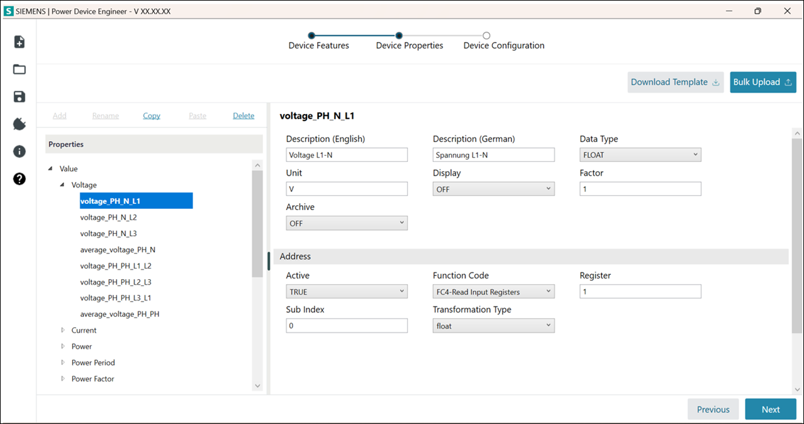
*Wizard-Seite 2 am Beispiel `voltage_PH_N_L1`: links der Properties-Baum, rechts die Feldgruppen.
Oben rechts `Download Template` / `Bulk Upload`. Unten der Abschnitt `Address` mit
Active = TRUE, Function Code = FC4-Read Input Registers, Register = 1, Sub Index = 0,
Transformation Type = float.*

### Konfigurierbare Felder je Property

| Feld | Bedeutung |
|---|---|
| `Description (English)` / `Description (German)` | Beschreibungstexte, zweisprachig |
| `Data Type` | Datentyp gemäß Modbus-Manual des Geräts |
| `Unit` | Einheit; Vorbelegung aus der gewählten Gruppe |
| `Display` | Anzeige im Measurement-Values-Tile der konsumierenden Applikation; Default `OFF` |
| `Factor` | Skalierungsfaktor, den der Modbus-Treiber beim Lesen anwendet |
| `Archive` | Archivierung der Werte |
| `Active` | Bei `true` pollt der Treiber die Property |
| `Function Code` | Modbus-Funktionscode gemäß Gerätemanual |
| `Register` | Registeradresse gemäß Gerätemanual |
| `Sub Index` | Subindex gemäß Gerätemanual |
| `Transformation Type` | Transformationstyp gemäß Gerätemanual |
| `Measurement point`, `Position`, `Length` | Nur bei BLOB-Strukturen |

**Feldspezifische Regeln:**

- `Factor`: maximal **drei** Dezimalstellen. Bei JSON-Dateien aus PDE ≤ V7.1.2 rundet das System
  automatisch auf drei Dezimalstellen. `[16027603467]`
- `Register` bei `Data Type = STRING`: Format `XX:XX` mit Doppelpunkt, z. B. `1:5`. `[33770547723]`

### Harmonics-spezifische Felder `[33770547723]`

Nur für die Gruppen `Voltage Harmonics` und `Current Harmonics`:
`Number Of Harmonics`, `Phase Information`, sowie die Checkbox
`Is this the maximum harmonic?` — diese erzeugt eine zweite Property gleichen Namens mit Suffix
`max`, die den maximal aufgezeichneten Wert der Oberschwingung führt.
Für Standard-Properties wird der Harmonics-Abschnitt nicht angezeigt.

### Command-Gruppe `[33770547723]`

`Digital Output` und `Write Value` existieren ausschließlich unter der Gruppe `Command`.
`Write Value` unterscheidet:

- **Fixed** — Kommandowert wird im Feld `Value` in PDE hinterlegt
- **Dynamic** — Kommandowert wird erst in der konsumierenden Applikation vergeben

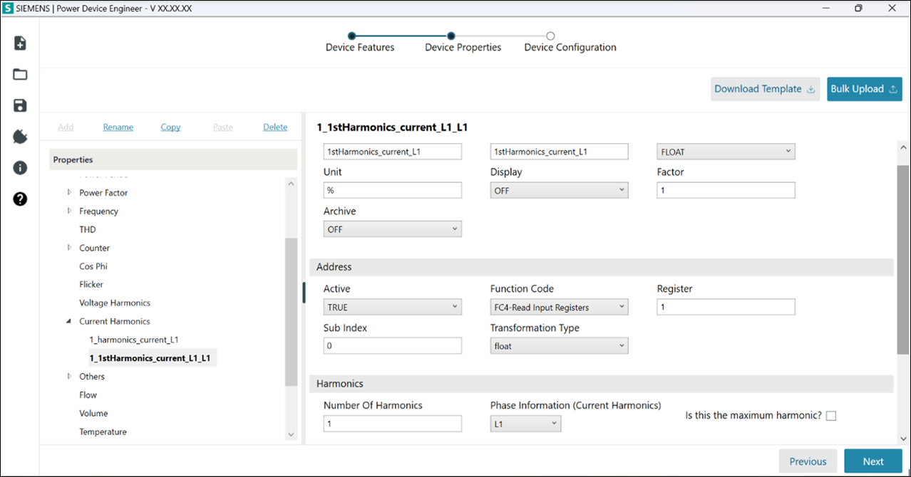
*Konfiguration von `Digital Output` und `Write Value` unter `Command`.*

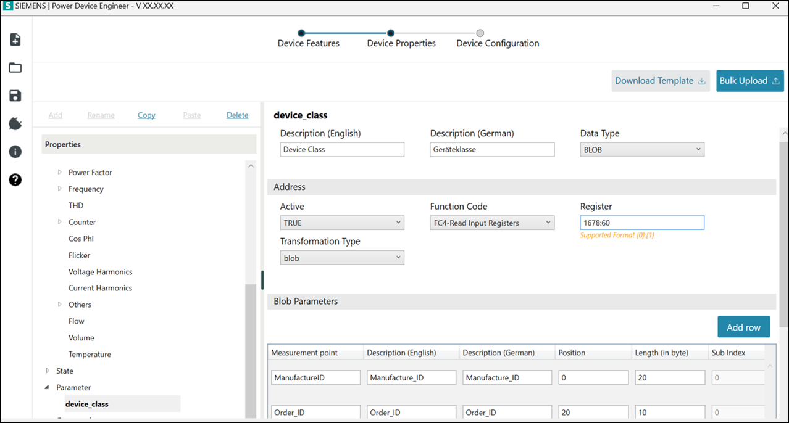
*Übersicht der konfigurierbaren Property-Felder.*

---

## 5. Datentypen und Transformationstypen

### Unterstützte Datentypen und Längen `[33770547723]`, `[16041253387]`

| Datentyp | Länge |
|---|---|
| INT | 2 oder 4 Byte |
| UINT | 2 oder 4 Byte |
| LONG | 8 Byte |
| ULONG | 8 Byte |
| STRING | max. 250 |
| FLOAT | 4 oder 8 Byte |
| BOOLEAN | 2 Byte, mit Subindex-Konfiguration |
| BLOB | Registerbereich, Notation `Offset:Bytes` |
| DateTime | 8 Byte (IEC 60870-5) |

`BLOB` und `DateTime` sind gegenüber Vorversionen **neu hinzugefügte** Datentypen. `[33770547723]`

### BCD und Packed BCD `[33945819915]`

| Transformation | Zulässiger Datentyp |
|---|---|
| bcd16 | UINT |
| bcd32 | UINT |
| pbcd16 | UINT |
| pbcd32 | UINT |
| bcd64 | ULONG |
| pbcd64 | ULONG |

### MOD10 `[33945819915]`

| Transformation | Zulässiger Datentyp |
|---|---|
| MOD10 Size 2 | INT, UINT |
| MOD10 Size 3 | LONG, ULONG |
| MOD10 Size 4 | LONG, ULONG |

> **Achtung, Widerspruch in der Quelle:** Der Fließtext in `[33945819915]` behauptet zusätzlich, für
> `INT` seien MOD10 Size 2, 3 **und** 4 zulässig, und für `ULONG` zusätzlich MOD10 Size 2. Die
> Tabellen im gleichen Topic sagen etwas anderes (siehe oben). Die Tabelle in `[33187168907]`
> (nicht unterstützte Online-Typen) stützt die Tabellen-Variante: dort steht INT nur mit
> `Mod10 Size2`, LONG/ULONG nur mit `Size3`/`Size4`. **Für die Arbeit die Tabellenwerte verwenden
> und am Testaufbau verifizieren.**

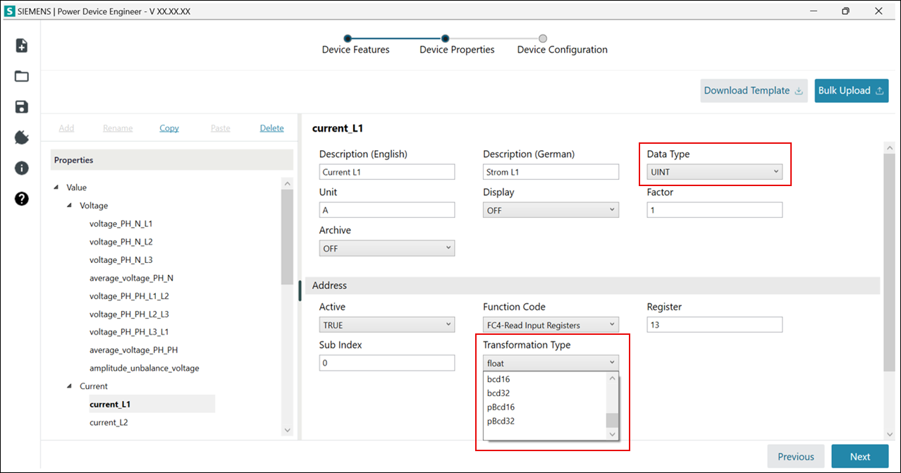
*BCD-Transformationstypen für UINT.*

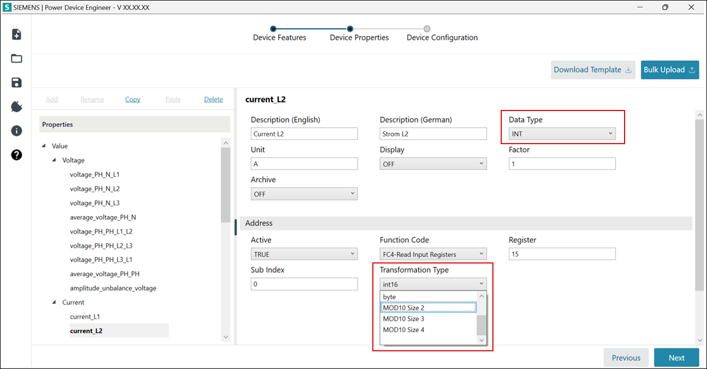
*MOD10-Auswahl.*

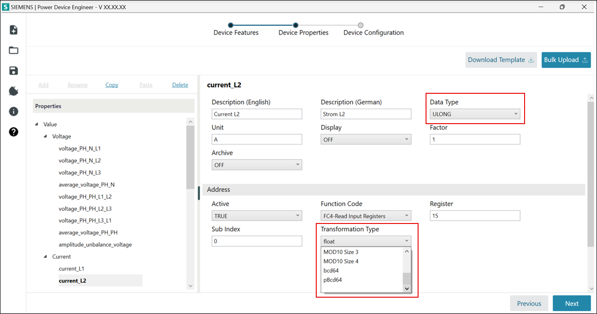
*MOD10-Auswahl für ULONG.*

### BLOB `[33770547723]`, `[33945817611]`

**Definition aus der Doku:** Ein Binary Large Object ist ein strukturierter Datenblock, der über
einen definierten Bereich von Modbus-Registern gespeichert ist. Er enthält gerätespezifische
Informationen in Binärform, typischerweise zur Identifikation, Konfiguration und Diagnose. Die
Struktur ist vordefiniert; jedes Segment ist auf ein Feld abgebildet.

- Jedes Register führt 16 Bit (2 Byte); Felder über mehrere Register werden konkateniert.
- Typische Feldinhalte: Manufacturer ID, Device Model / Order ID, Serial Number, Hardware- und
  Software-Revision, gerätespezifische Parameter.
- Auslesen über Funktionscodes **0x03** (Read Holding Registers) oder **0x04** (Read Input Registers);
  die Interpretation richtet sich nach der Gerätespezifikation. Korrekte Behandlung der Endianness
  ist zwingend.
- Bei `Data Type = BLOB` ist `Transformation Type` zwangsweise ebenfalls `BLOB`.
- Registernotation: `Offset : Anzahl Bytes`.

**Dokumentiertes Beispiel — I&M0 des SENTRON PAC4200:**

| Offset | Register | Name | Format | FC | Access |
|---|---|---|---|---|---|
| 64001 | 27 | IM Data PAC4200 | stIMO | 0x03, 0x04 | R(W) |

27 Register × 2 Byte = 54 Byte → Registerangabe in PDE: **`64001:54`**

Unter dem Expander `BLOB Parameters` werden je Messpunkt konfiguriert: `Measurement point`,
`Description (English/German)`, `Position`, `Length` (in Byte), `Sub Index`, `Unit`, `Display`,
`Factor`, `Archive`, `DataType`. `Add row` fügt Messpunkte hinzu, `Delete` entfernt sie.

- Die **Anzahl der Messpunkte ist unbegrenzt**.
- `Sub Index` ist nur für `DataType = BOOL` innerhalb der BLOB-Parameter aktiv.
- Fehlerhafte Messpunkte werden rot markiert, an der Property erscheint ein Fehlersymbol.
- Für `DataType = BLOB` lassen sich sowohl **IM0** als auch **IM1** konfigurieren.

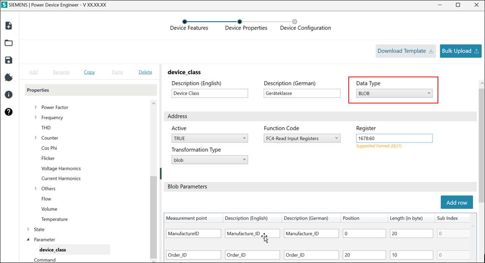
*Datentyp BLOB mit Registerangabe `64001:54` und BLOB-Parameter-Tabelle.*

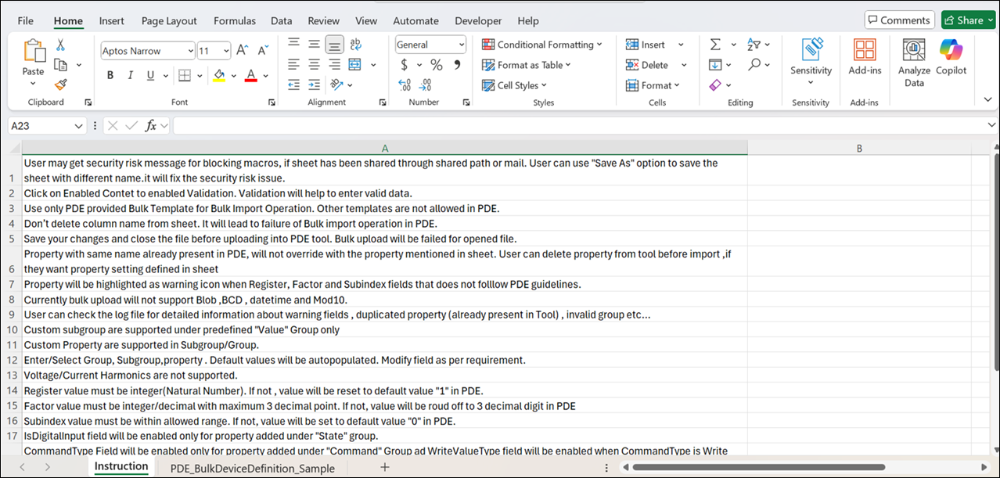
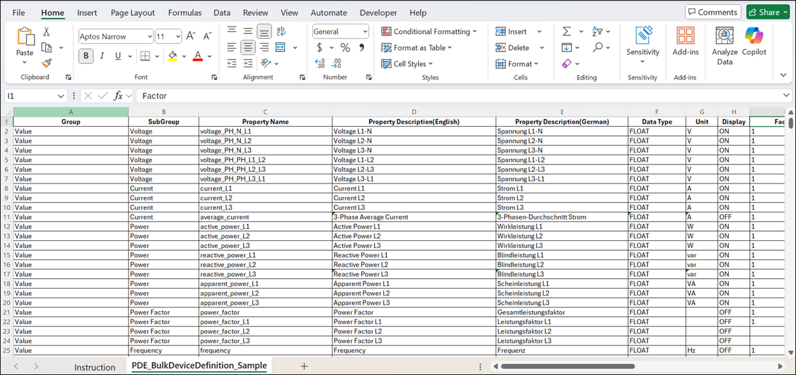
*Konfiguration von Manufacture ID und Order ID aus dem I&M0-Block.*

### DateTime `[33945818763]`

- Format nach **IEC 60870-5**
- `Transformation Type` ist per Default `BLOB`
- Standard erfordert **8 Byte** ab dem Startregister
- unterstützt **ausschließlich Big-Endian**
- **`Alarm` und `Archive` sind für DateTime nicht verfügbar**

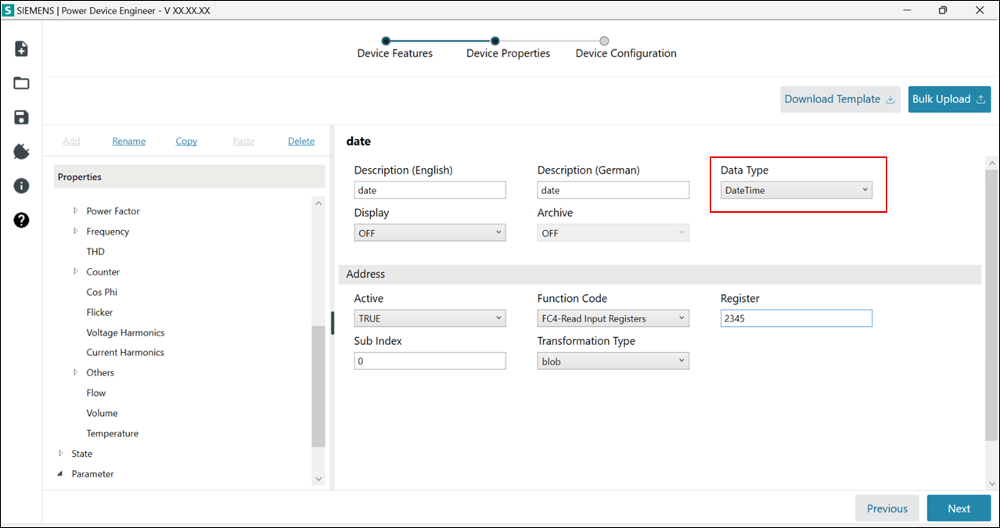
*Datentyp Date Time; Transformation Type ist auf BLOB festgelegt.*

---

## 6. Schritt 4 — Device Configuration `[33770545419]`

Konfiguriert die Darstellung in **SENTRON Powermanager**: Default Measurement Points, Favorites
und Trend-Tiles.

### Default Measurement Points — mit Einheitenbedingung

| Messpunkt | Default-Vorbelegung (falls vorhanden) | Bedingung |
|---|---|---|
| Active Power | `Active_power` | Property in Gruppe **power**, Einheit kW, W oder MW |
| Reactive Power | `reactive_power_Qn` (Reactive Power (VARn)) | Property in Gruppe **power**, Einheit kvar, var oder Mvar |
| Active Energy | `active_energy_import_tariff_1` | Property in Gruppe **counter**, Einheit kWh, Wh oder MWh |
| Reactive Energy | `reactive_energy_import_tariff_1` | Property in Gruppe **counter**, Einheit kvarh, varh oder Mvarh |

> **Wichtig für Kapitel 520 (Auswahl der Daten):** Die Einheitenbedingung ist eine harte
> Auswahlrestriktion. Ein Leistungsdatenpunkt, der nicht in der Gruppe `power` mit passender
> Einheit liegt, ist als Default Measurement Point nicht wählbar. Das ist ein belastbares Argument
> für die Gruppenzuordnung im Datenmodell.
>
> **Abweichung Screenshot ↔ Text:** Der Screenshot zeigt als Vorbelegung
> `collective_active_power` bzw. `collective_reactive_power`, der Fließtext nennt `Active_power`
> bzw. `reactive_power_Qn`. Am Testaufbau prüfen, welche Bezeichner die V9.1.0 tatsächlich setzt.

### Favorites

Spalten: `Control Type` (read-only), `Device`, `Measurement Point`, `Parameter` (Grenzwerte und
Farben der Gauges), `Duration` (Dauer und Zeitintervall der Aufzeichnung), Checkbox `Compare`.

Darstellungsformen: **drei Gauges, drei Trends, ein Bar Chart.**

- **Gauges** — zeigen Beschreibung des Messpunkts, Farbbereich, Wert und Einheit
- **Trend** — Verlauf über einen Zeitraum; beliebig viele hierarchisch angeordnete Bereiche für
  Kurven mit Skalen und Legenden; erlaubt visuellen Vergleich einzelner Trends
- **Barchart** — Default-Intervall ein Monat

**Grenze:** maximal **sieben** Gruppen mit je maximal **sieben** Messpunkten. `[16027603467]`

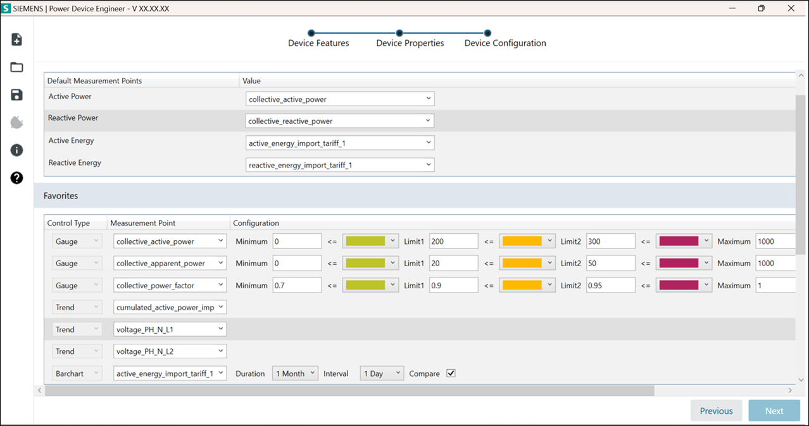
*Wizard-Seite 3. Oben Default Measurement Points, unten Favorites mit Gauge-Grenzwerten
(Minimum / Limit1 / Limit2 / Maximum je mit Farbzuordnung) und Barchart mit
Duration = 1 Month, Interval = 1 Day, Compare aktiv.*

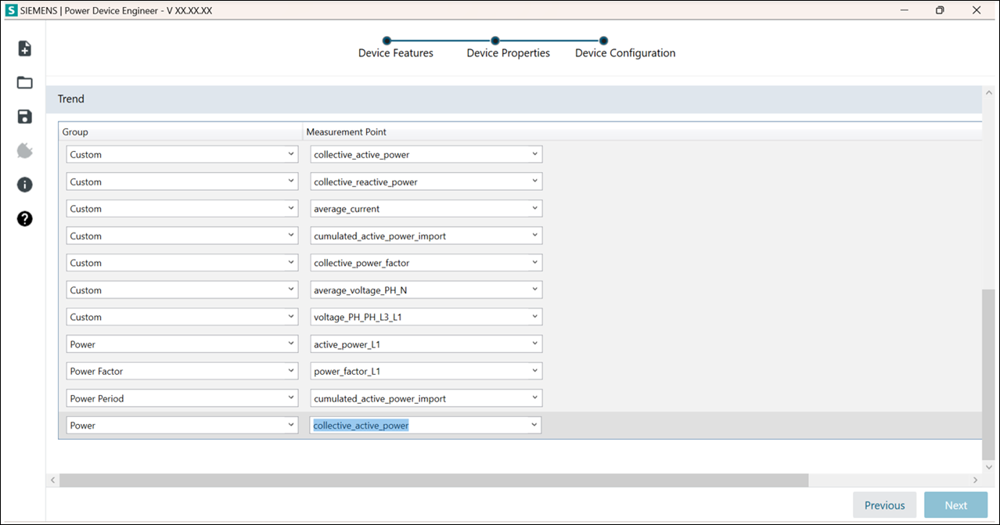
*Trends-Abschnitt.*

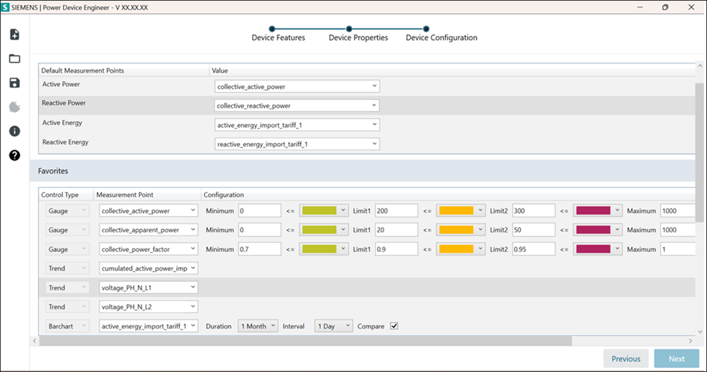
*Übersicht des Abschnitts Device Configuration.*

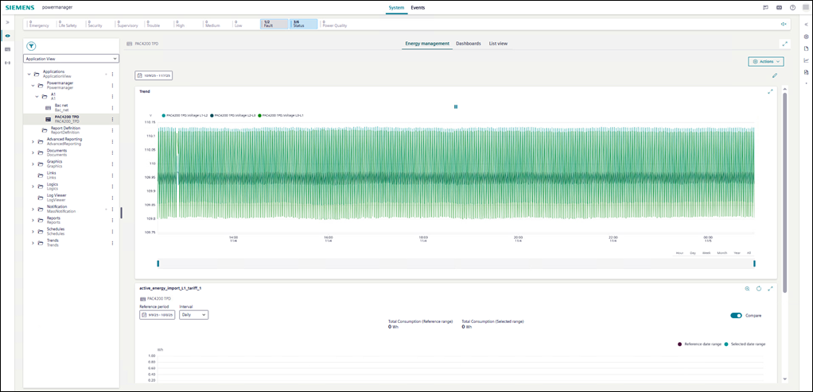
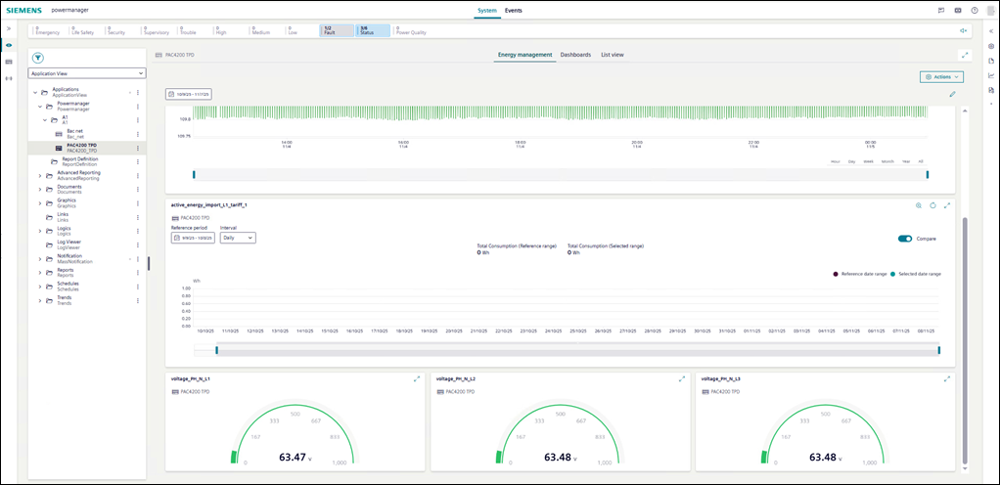
*Die Chart-Typen in SENTRON Powermanager, für die die Datenpunkte in Device Configuration
konfiguriert werden.*

Auf Wizard-Seite 3 ist `Next` deaktiviert, da es die letzte Konfigurationsseite ist. `[16027603467]`

---

## 7. Schritt 5 — JSON erzeugen `[16027603467]`

`Save` in der Toolbar → `Save As`-Dialog mit Default-Pfad → Dateiname → `Save`.
**Bei Fehlern in den Feldangaben ist das Speichern nicht möglich.** Ein Logging-Mechanismus
protokolliert die Fehler der einzelnen Schritte.

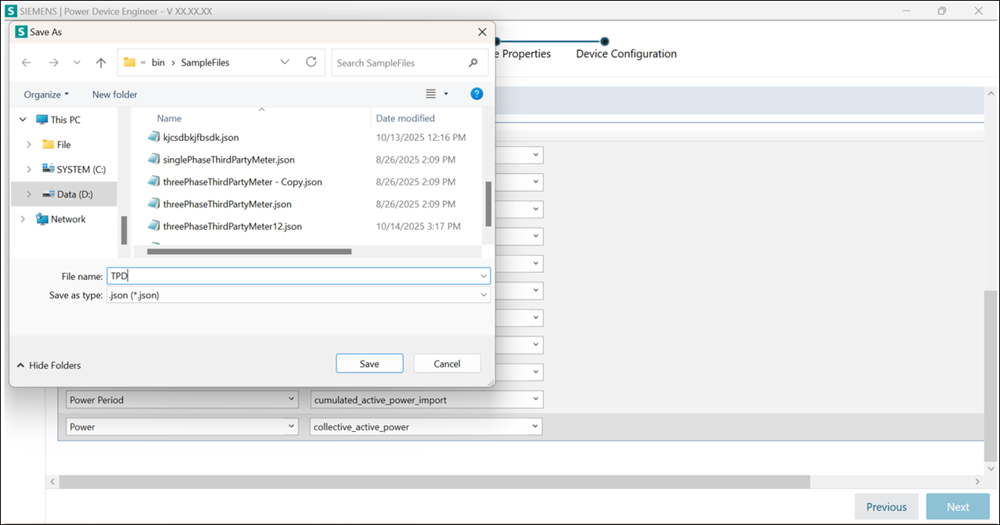
*Speichern der JSON-Datei.*

### Zeichensatzbeschränkungen `[16027603467]`

| Betrifft | Zulässige Zeichen |
|---|---|
| **PDE**: Device Name, Property Name, Group Name | `0-9`, `A-Z`, `a-z`, `_`, `ö ä ü ß Ü Ö Ä` |
| **Powermanager**: Device Name, Area Name, Sector Name, Report Name | `0-9`, `A-Z`, `a-z`, `_`, `ö ä ü ß Ü Ö Ä` |

Andere Zeichen sind nicht erlaubt.

### Kompatibilitätswarnung — zentral für die kritische Würdigung `[16027603467]`

- Änderungen an einer bestehenden Gerätetyp-JSON wirken in der SENTRON-Applikation **nur für neue
  Geräte**, die unter diesem Gerätetyp angelegt werden.
- Es wird **dringend empfohlen, Property-Name und Property-Typ nicht zu ändern**, wenn die JSON
  bereits in der Applikation verwendet wird und Instanzen dieses Gerätetyps existieren:
  *„All functions using this device as the source in SENTRON will be disrupted."*

> **Verwertbar in Kapitel 700 (Bewertung / kritische Würdigung):** Das Datenmodell ist nach dem
> ersten produktiven Einsatz faktisch schemastarr. Versionierung und Namensstabilität sind damit
> keine Stilfrage, sondern eine harte Entwurfsanforderung.

---

## 8. Bulk Upload über Excel-Template `[30652824203]`

Ablauf: `Download Template` → Excel ausfüllen → speichern und schließen → `Bulk Upload` → Datei
wählen → Ergebnisdialog → `OK` → `Next`.

- Es werden **ausschließlich Templates aus der PDE-Anwendung** akzeptiert.
- Ist die Excel-Datei durch Windows blockiert: Excel schließen, Rechtsklick → Eigenschaften →
  Reiter Allgemein → unter Sicherheit `Unblock` aktivieren → Übernehmen → Excel neu öffnen.
- Der Ergebnisdialog meldet Upload-Erfolg, Fehler und Feldwarnungen.
  **Warnsymbol** = Feld wurde nach dem Bulk Upload verändert. **Fehlersymbol** = Pflichtfeld fehlt.
  Details stehen in der Logdatei.

### Nicht per Bulk Import konfigurierbar `[33770547723]`

**Harmonics-Properties, BLOB, BCD, MOD10 und DateTime.** Diese erfordern manuelle Konfiguration —
die Doku formuliert das in `[30652824203]` als *„specialized properties require manual
configuration"*.

> **Verwertbar in Kapitel 700:** Genau die aufwendigsten Datentypen sind von der Automatisierung
> ausgenommen. Bei einem Gerätetyp mit vielen Oberschwingungs- oder BLOB-Datenpunkten entfällt der
> Effizienzvorteil des Bulk Uploads weitgehend.

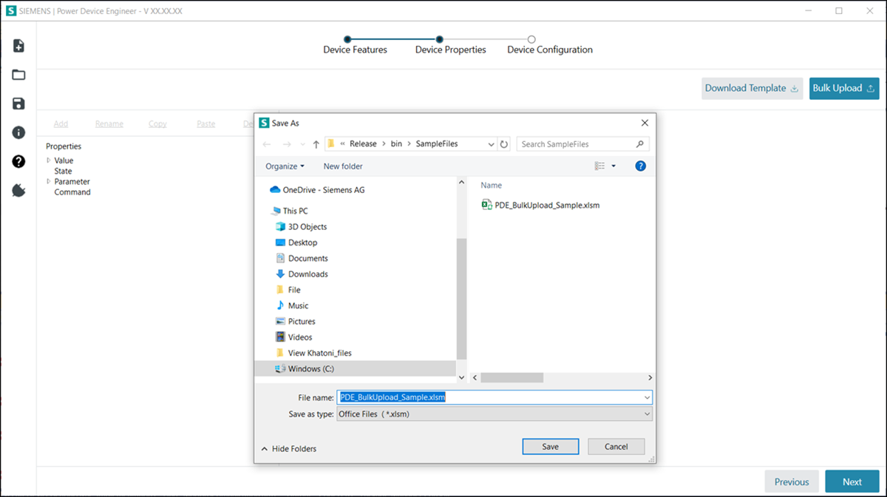
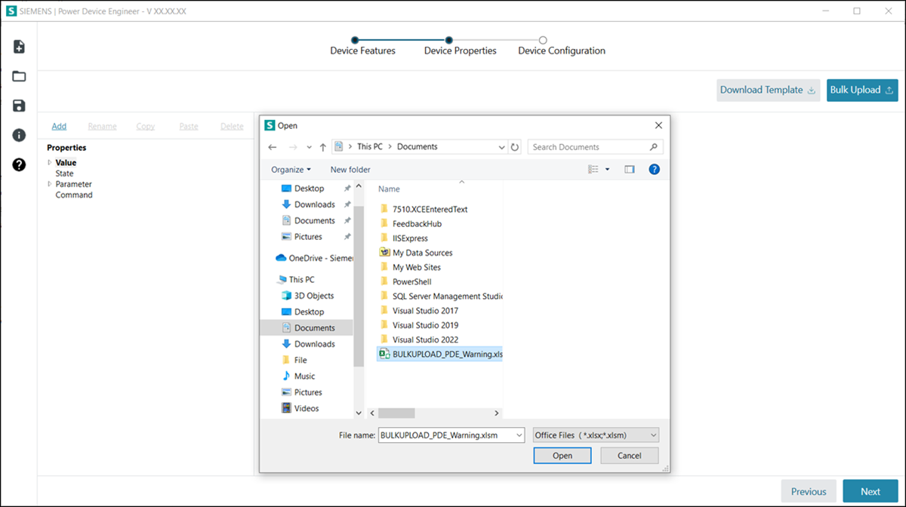
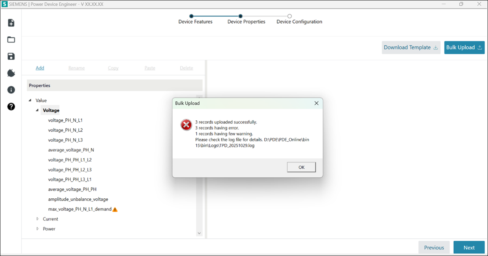
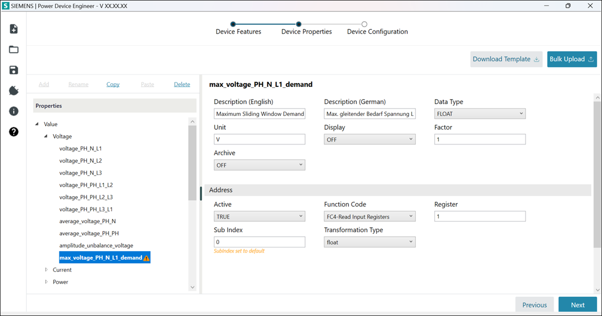

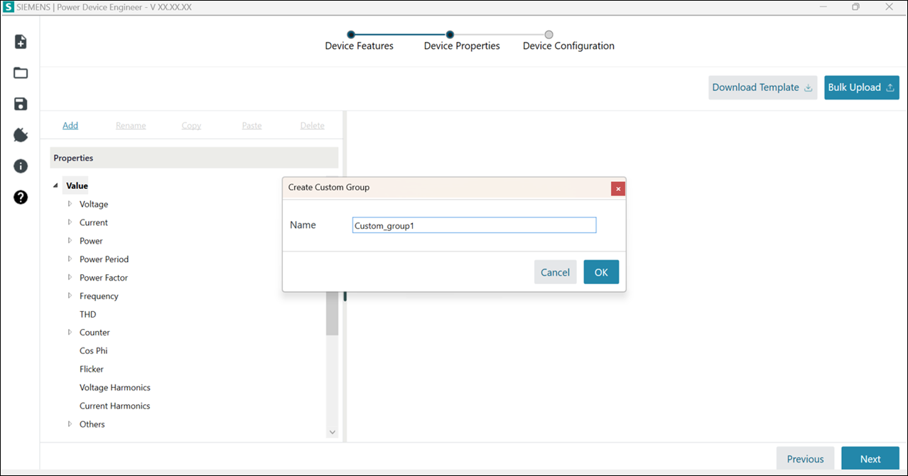
*Anlegen einer benutzerdefinierten Gruppe unter `Value` (max. fünf).*

---

## 9. Online-Modus `[33187168907]`, `[33770547723]`

**Zweck:** Validierung der Konfiguration gegen ein physisches Gerät — Echtzeitwerte lesen und
prüfen, ob die Property-Einstellungen korrekt sind, **bevor** in SENTRON-Applikationen deployed wird.

- **Offline-Modus (Default):** Gerätetypen anlegen und konfigurieren ohne physisches Gerät
- **Online-Modus:** Verbindung zu einem physischen Gerät, Anzeige realer Werte in Echtzeit

**Voraussetzungen:** mindestens eine Device Property im Offline-Modus angelegt; Datenpunkte
konfiguriert. Der Online-Modus ist **ausschließlich im Abschnitt Device Properties verfügbar**.

**Ablauf:** Online-Modus über Schalter links aktivieren → Bestätigungsdialog `Switch to Online Mode`
→ `Configuration` unten im Properties-Tab → Verbindungsdaten → `Check Status` → Properties per
Checkbox wählen → `Check Values`.

### Verbindungsparameter

| Variante | Voraussetzung | Felder |
|---|---|---|
| **Modbus RTU** | Feature `RTU Communication Only` **aktiviert** | `IP Address` (des Modbus-Gateways am RTU-Gerät), `Port` (Default **502**), `Unit Identifier` (Slave-Adresse, Default **1**) |
| **Modbus TCP/IP** | Feature `RTU Communication Only` **deaktiviert** | `IP Address`, `Port` — **kein** `Unit Identifier` |

**Device Status:** `Blank` (Verbindungsversuch läuft / kein Ergebnis) → `Connected` (erfolgreich)
bzw. `Disconnected`. Bei `Blank` oder `Disconnected` muss die Verbindung neu konfiguriert werden;
der Dialog bietet `Cancel` und `Retry`.
`Check Values` wird erst aktiv, wenn `Device Status = Connected`.
Mehrere Datenpunkte lassen sich gleichzeitig auswählen; erneutes `Check Values` aktualisiert die Werte.

### Im Online-Modus NICHT unterstützte Kombinationen

| # | Datentyp | Transformationstyp |
|---|---|---|
| 1 | FLOAT | Float with timestamp |
| 2 | INT | Mod10 Size2 |
| 3 | UINT | Mod10 Size2, bcd16, pbcd16, bcd32, pbcd32 |
| 4 | LONG | Mod10 Size3, Mod10 Size4 |
| 5 | ULONG | Mod10 Size3, Mod10 Size4, bcd64, pbcd64 |
| 6 | BLOB | blob |
| 7 | DateTime | blob |
| 8 | STRING | string |
| 9 | BOOLEAN | bool |

Bei Auswahlversuch erscheint der Tooltip
*„Selection not allowed for unsupported property in online mode"*.

> **Zentraler Befund für Kapitel 600 (Validierung) und 700:** Der Online-Modus kann **keinen
> einzigen** BCD-, MOD10-, BLOB-, DateTime-, String- oder Boolean-Datenpunkt verifizieren.
> Verifizierbar sind praktisch nur INT/UINT/LONG/ULONG ohne Transformation und FLOAT ohne
> Zeitstempel. Für alle übrigen Datenpunkte muss die Validierung anders erfolgen — das begründet
> die Validierungsstrategie am Hardware-Testaufbau.

### Beenden

Die Anwendung kann im Online-Modus **nicht** beendet werden; es erscheint der Warndialog
`Exit Restricted`. Vor dem Beenden ist in den Offline-Modus zurückzuschalten, wodurch die
Verbindung zum Gerät getrennt wird.

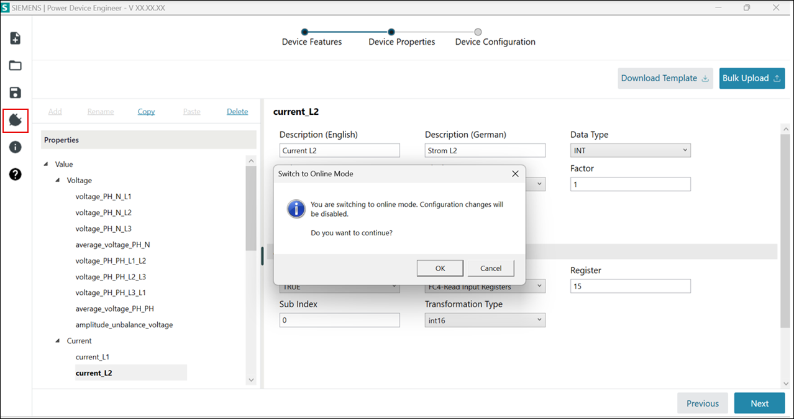
*Bestätigungsdialog beim Wechsel in den Online-Modus.*

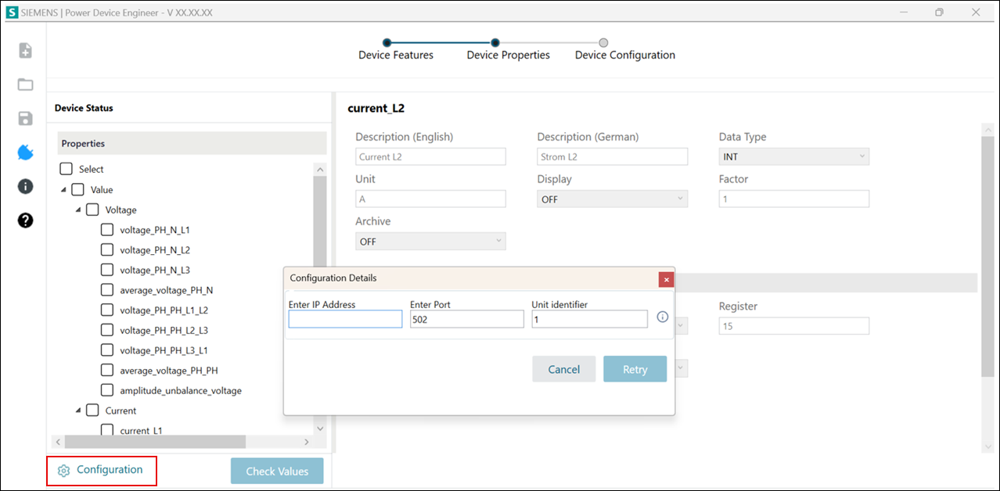
*`Configuration Details` für Modbus RTU: IP-Adresse, Port 502, Unit Identifier 1. Links der
Properties-Baum mit Auswahl-Checkboxen, unten `Configuration` und `Check Values`.*

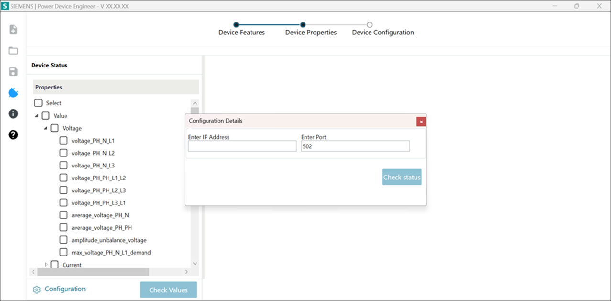
*Verbindungsdaten für Modbus TCP/IP — ohne Unit Identifier.*

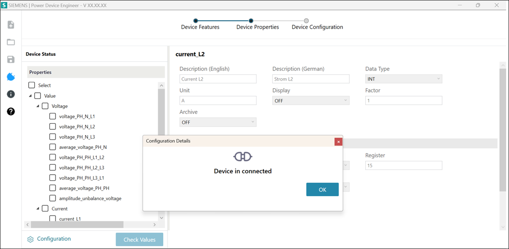
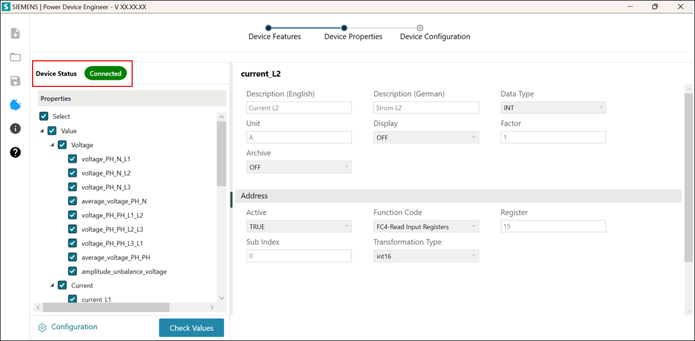
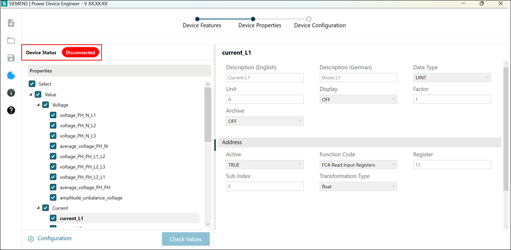
*Device Status in den Zuständen Blank, Connected und Disconnected mit Retry.*

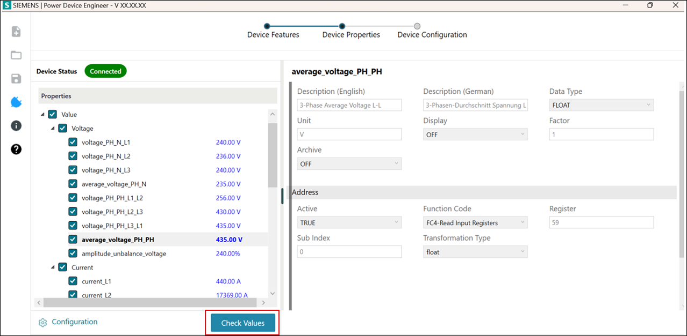
*Echtzeitwerte der ausgewählten Properties nach `Check Values`.*

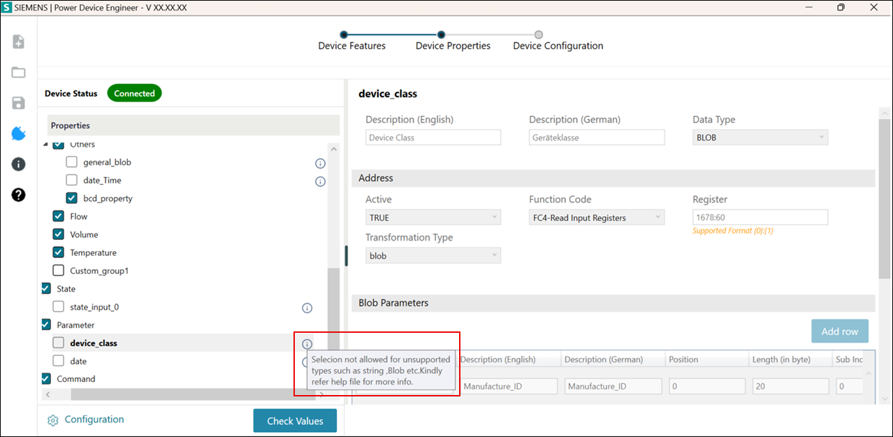
*Tooltip bei Auswahl eines im Online-Modus nicht unterstützten Datentyps.*

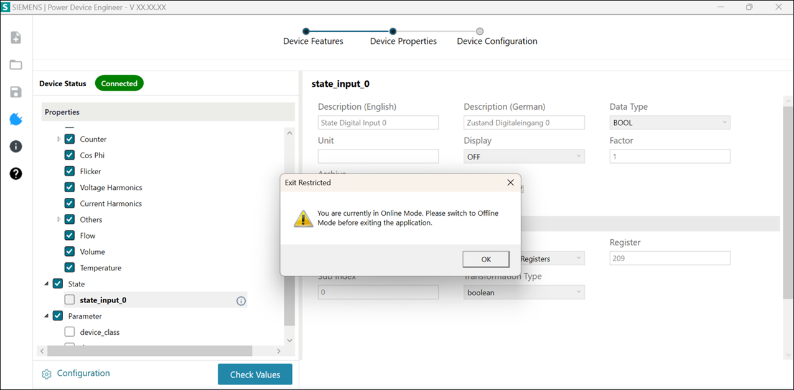
*Warndialog beim Versuch, die Anwendung im Online-Modus zu beenden.*

---

## 10. Sammlung der harten Grenzen und Restriktionen

Kompakte Liste für die Anforderungs- und Bewertungskapitel:

| Restriktion | Wert | Quelle |
|---|---|---|
| Benutzerdefinierte Gruppen | max. 5, nur unter `Value` | `[30675608203]` |
| Gruppen in Device Configuration | max. 7 | `[16027603467]` |
| Messpunkte je Gruppe | max. 7 | `[16027603467]` |
| Dezimalstellen im `Factor` | max. 3 | `[16027603467]` |
| Messpunkte je BLOB | unbegrenzt | `[33945817611]` |
| STRING-Länge | max. 250 | `[33770547723]` |
| DateTime | 8 Byte, nur Big-Endian, kein Alarm/Archive | `[33945818763]` |
| Standardgruppen löschen | nicht möglich | `[33770547723]` |
| `Sub Index` in BLOB-Parametern | nur bei `BOOL` | `[33945817611]` |
| Zeichensatz für Namen | `0-9 A-Z a-z _ äöüßÄÖÜ` | `[16027603467]` |
| Bulk Import | ohne Harmonics, BLOB, BCD, MOD10, DateTime | `[33770547723]` |
| Online-Modus | nur in Device Properties; 9 Typkombinationen ausgeschlossen | `[33187168907]` |
| Beenden im Online-Modus | nicht möglich | `[33187168907]` |
| Speichern bei Feldfehlern | nicht möglich | `[16027603467]` |
| Property-Name/-Typ nach Produktiveinsatz ändern | bricht bestehende Instanzen | `[16027603467]` |

---

## 11. Nicht verwertete Inhalte der Quelle

Bewusst nicht aufgenommen, da für die Fragestellung ohne Substanz:

- **Data Privacy** `[28037700107]` — DSGVO-Boilerplate (Art. 6 Abs. 1 lit. a/b/f, Binding
  Corporate Rules, EU-Standardvertragsklauseln, Kontakt dataprotection@siemens.com)
- **Cybersecurity Policies** `[28037700107]` — allgemeine Härtungsempfehlungen: Anti-Malware,
  Patch-Management, Backup/Recovery, Benutzerverwaltung, starke Passwörter, Firewall, Deaktivieren
  nicht benötigter Dienste, physische Sicherheit, jährliche Awareness-Schulung,
  Installationsordner auf read-only, CIS-Benchmarks, Principle of Least Privilege
- **`New Node`** `[33891572747]` — leeres Topic, offenkundig ein Redaktionsartefakt der Quelle
- Navigations- und Übersichtstopics ohne eigenen Inhalt: `[15959509515]`, `[16041227659]`,
  `[33891571595]`, `index`, `search`

Falls Security in Kapitel 720 (Bewertung Praxistauglichkeit) thematisiert wird, ist der
Cybersecurity-Abschnitt als Belegstelle dafür brauchbar, dass Siemens die Absicherung explizit dem
Betreiber zuweist.

---

## 12. Offene Punkte für die Verifikation am Testaufbau

1. **MOD10-Zuordnung** — Widerspruch Fließtext ↔ Tabellen in `[33945819915]` (Abschnitt 5)
2. **Bezeichner der Default Measurement Points** — `collective_active_power` (Screenshot) vs.
   `Active_power` (Text) in `[33770545419]` (Abschnitt 6)
3. **Desigo CC** — kommt in der gesamten PDE-Doku nicht vor; Import-Pfad über Powercenter 3000
   muss eigenständig belegt werden
4. **JSON-Schema selbst** — die Doku beschreibt ausschließlich die GUI, **nicht** die Struktur der
   erzeugten JSON-Datei. Für Kapitel 530 muss das Schema aus einer real erzeugten Datei abgeleitet
   werden.

---

## 13. Hinweise zur Verwendung im Typst-Dokument

- **Zitation:** `@src:pdemanual` (Eintrag liegt in `resources/quellen.bib`)
- **Bilder:** liegen unter `resources/img/pde/`, Einbindung aus einer Unterkapiteldatei:
  ```typst
  #figure(
    image("../../resources/img/pde/wizard1_device_features.png", width: 90%),
    caption: [Wizard-Seite Device Features des #acro("PDE") @src:pdemanual]
  )
  ```
- **Rechtefrage offen:** Es handelt sich um Screenshots aus der Siemens-internen Produktdoku. Vor
  der Verwendung in der abgegebenen Arbeit mit dem Betreuer klären.
- **Vorhandene Akronyme** (`config/acronyms.typ`): `PDE`, `JSON`, `RTU`, `TCP`, `IP`, `HTTP`,
  `HTTPS`, `ECPD`, `API`, `ASCII`
- **Noch nicht vorhanden**, vor Verwendung in `acronyms.typ` ergänzen:
  `BLOB` = Binary Large Object, `BCD` = Binary Coded Decimal,
  `THD` = Total Harmonic Distortion, `FC` = Function Code
- **Rohtext der Quelle:** Der extrahierte Reintext aller Topics liegt im Scratchpad dieser Session
  (`noncmh_text/_ALL.md`) — bei Bedarf neu erzeugbar aus `NonCHM/en-US/*.html`.
